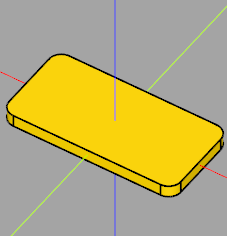
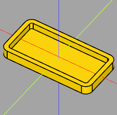
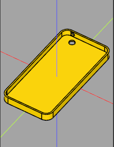
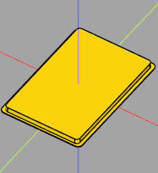
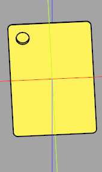
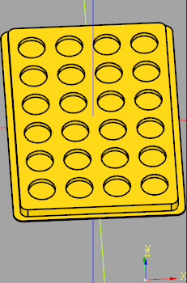
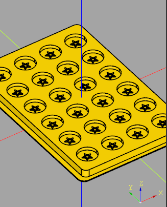
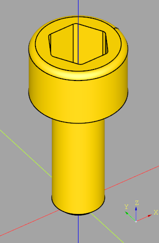
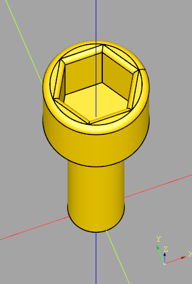
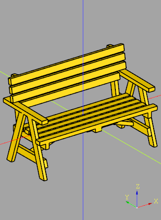

# Python CadQuery Engineering Projects

A portfolio of parametric CAD models developed using **Python and CadQuery**.

This repository documents my progression from fundamental CadQuery operations to multi-stage engineering modeling, repeated feature generation, model modification, debugging, and STL export.

Rather than showing only finished models, the repository preserves intermediate development stages to demonstrate the engineering and problem-solving process behind each result.

---

## Technologies

- Python
- CadQuery
- Parametric CAD Modeling
- Computational Geometry
- Boolean Operations
- Workplanes and Selectors
- 3D Transformations
- Repeated Feature Generation
- STL Generation
- Engineering Model Debugging

---

## Repository Structure

```text
python-cadquery-engineering-projects/
│
├── learning-exercises/
│   ├── debugging/
│   └── outputs/
│
├── projects/
│   ├── task-1/
│   │   ├── stages/
│   │   ├── final/
│   │   └── renders/
│   │
│   ├── task-2/
│   │   ├── stages/
│   │   ├── final/
│   │   └── renders/
│   │
│   ├── task-3/
│   │   ├── original/
│   │   ├── modified/
│   │   └── renders/
│   │
│   └── task-4/
│       ├── final/
│       └── renders/
│
├── requirements.txt
├── .gitignore
└── README.md
```

---

# Learning Exercises

The `learning-exercises` directory contains smaller models developed while learning the CadQuery workflow.

Topics covered include:

- Basic boxes and primitives
- Cylinders and holes
- Multiple-hole patterns
- Parameterized geometry
- Cylindrical cutouts
- Custom profiles
- Sketching and extrusion
- Boolean union and subtraction
- Rounded geometry
- Shell operations
- Loft operations
- Workplanes
- Selectors
- Translation, rotation, and mirroring
- STL exporting
- Debugging CadQuery geometry

These exercises provided the foundation for the larger engineering tasks in the `projects` directory.

---

# Engineering Projects

## Task 1 — Parametric Tray with Multiple Openings

Task 1 demonstrates the progressive development of a rounded tray-like component using parameterized dimensions and Boolean operations.

### Stage 1 — Base and Perimeter

The first stage establishes the basic outer body and perimeter geometry.



### Stage 2 — Rounded Internal Cavity

The second stage introduces the internal cavity and rounded internal geometry.



### Stage 3 — Circular Openings

The third stage adds:

- A circular side-wall opening
- A circular floor opening

It also refines the overall model dimensions and feature positions.



### Stage 4 — Final Model

The final stage adds:

- A rounded rectangular floor opening
- A centered rectangular floor opening
- A rectangular side-wall opening

The final model combines the outer body, rounded cavity, circular openings, and rectangular openings.


---

## Task 2 — Repeated Parametric Feature Model

Task 2 demonstrates a more complex modeling workflow involving repeated geometry and feature placement.

### Main Body

The model begins with the main base and outer body geometry.



### Hollow Feature Development

The next stage introduces the hollow geometry and circular feature development.



### Repeated Feature Pattern

The model then generates **24 repeated feature positions** programmatically instead of modeling each feature manually.



### Final Model

The final stage adds the raised five-point star geometry and completes the repeated feature layout.



### Development Stages

1. Main base body
2. Outer body geometry
3. Circular opening
4. Hollow-body development
5. Repeated feature generation
6. Raised five-point star features

This task demonstrates how parametric programming can automate repetitive CAD operations and maintain consistent feature placement.

The project also includes the final exported STL model.

---

## Task 3 — Existing Model Modification

Task 3 focuses on modifying an existing CadQuery model rather than building a component entirely from scratch.

The repository preserves both the original and modified versions to provide a clear before-and-after comparison.

### Original Model



### Modified Model



The project demonstrates:

- Understanding existing CadQuery code
- Modifying parameterized geometry
- Changing geometric proportions
- Creating additional geometric features
- Using polygon-based geometry
- Refining features using fillets
- Exporting the modified model to STL

This task demonstrates the ability to read, understand, and extend an existing parametric CAD script.

---

## Task 4 — CadQuery Debugging

Task 4 focuses on diagnosing and correcting a non-working CadQuery model.

The work involved identifying issues in the modeling logic, correcting the script, and producing a functional final model.

### Corrected Model



This task demonstrates an important engineering programming skill: not only creating CAD geometry, but also understanding and debugging existing parametric modeling code.

---

# Engineering Workflow

The projects collectively demonstrate the following workflow:

```text
Reference Geometry
        ↓
Dimension Analysis
        ↓
Parameterized Model
        ↓
Feature Construction
        ↓
Boolean Operations
        ↓
Workplane / Coordinate Management
        ↓
Pattern Generation
        ↓
Debugging and Refinement
        ↓
Final Geometry
        ↓
STL Export
```

---

# Running the Models

Install the required dependency:

```bash
pip install -r requirements.txt
```

The scripts are designed for use with a CadQuery-compatible Python environment such as **CQ-editor**.

Example:

```python
import cadquery as cq

model = cq.Workplane("XY").box(20, 10, 5)

show_object(model)
```

---

# Project Goals

This repository documents practical experience with:

- Parametric engineering design
- Python-based CAD automation
- Computational geometry
- Iterative model development
- Geometric problem solving
- Engineering scripting
- Feature pattern generation
- Debugging
- 3D model generation
- STL export

The staged project structure intentionally preserves the development process instead of showing only the final outputs.

---

# Future Improvements

Planned improvements include:

- Adding additional model views
- Adding more STL exports
- Improving parameter organization
- Creating reusable modeling functions
- Expanding the repository with more advanced CadQuery projects

---

## Author

**Nouran Salama**

Computer Engineering student at the Egypt-Japan University of Science and Technology (E-JUST) with hands-on experience in Machine Learning, Deep Learning, Generative AI, Retrieval-Augmented Generation (RAG), Embedded Systems, Robotics, and Software Development.

Experienced in building end-to-end AI applications involving NLP, Transformers, LLMs, semantic retrieval, vector databases, REST APIs, and interactive interfaces.

Co-author of an IEEE-published research paper on Vision Transformer-based skin disease detection.